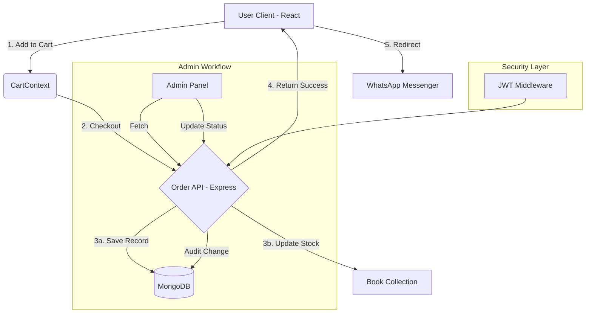

# 🏗️ Bookstore System Architecture

## 🧬 System Flow Diagram

## 🛠️ Technology Stack

| Layer | Technology | Purpose |
| :--- | :--- | :--- |
| **Frontend** | React, Vite | Ultra-fast UI and state management |
| **Styling** | Vanilla CSS, Framer Motion | Premium look and smooth animations |
| **Icons** | Lucide-React | Crisp, modern iconography |
| **Backend** | Node.js, Express | Scalable API architecture |
| **Database** | MongoDB, Mongoose | Flexible NoSQL data storage |
| **Auth** | JSON Web Tokens (JWT) | Secure session management |

## 📦 Data Models Relationship

1.  **User**: Stores credentials and phone number (used for WhatsApp).
2.  **Book**: Stores title, price, description, and **live stock quantity**.
3.  **Order**: Links **User** and **Books**. It captures precisely what was bought, at what price, and current delivery status.

## 🔐 Security Architecture
- All sensitive operations (Ordering, Admin updates) require a valid JWT in the `Authorization` header.
- Password hashing is enforced using `BcryptJS` before saving to the database.
- Backend validation ensures that no order can be placed for products that do not exist (ID validation).
