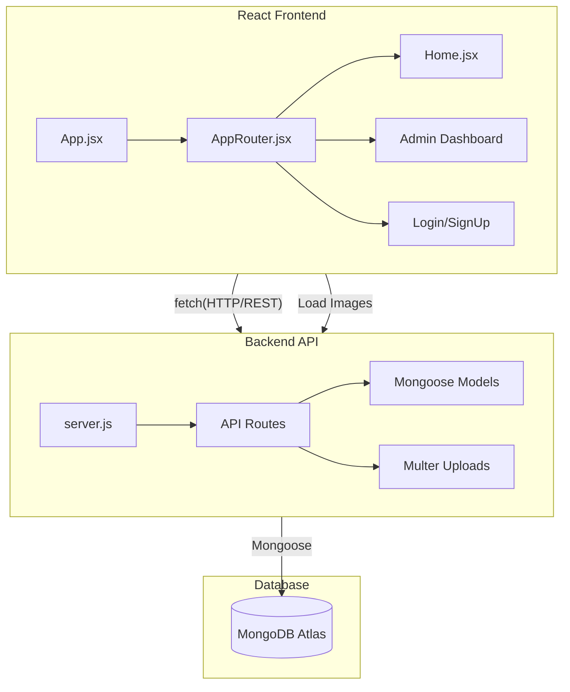

# LuminaBooks Technical Architecture

This document outlines the full-stack architecture of **LuminaBooks**, covering both the frontend and backend components.

## Tech Stack Overview

| Layer | Technology | Description |
| :--- | :--- | :--- |
| **Frontend** | React (Vite) | Core framework for the user interface. |
| **Backend** | Express (Node.js) | REST API server for data management and uploads. |
| **Database** | MongoDB Atlas | Cloud-based NoSQL database for book and user data. |
| **File Storage** | Multer + Local FS | Handles local file uploads for book covers. |
| **Styling** | Vanilla CSS | Custom design system using CSS variables. |
| **Animations** | Framer Motion | Smooth transitions and micro-animations. |

## System Architecture

The application is a full-stack MERN-style app (React, Express, MongoDB) where the frontend communicates with the backend via RESTful APIs.

## Directory Structure

### Frontend (`/`)
- `src/`: React source code.
  - `components/`: Navbar, UI elements.
  - `pages/`: Home, Admin, Auth.
  - `AppRouter.jsx`: Route definitions.
- `public/`: Static assets.

### Backend (`/server`)
- `server.js`: Main entry point and server config.
- `models/`: Mongoose schemas.
- `routes/`: API endpoint definitions.
- `uploads/`: Local directory for uploaded cover images.
- `.env`: Environment variables.

## Data Flow
1. **Fetching**: Frontend uses `fetch` to get JSON data from the backend.
2. **Uploading**: Books are added via `FormData` to include images.
3. **Serving**: The backend serves the `uploads/` folder as a static directory.
4. **Cleanup**: Deleting a book triggers both a DB deletion and a physical file removal.
