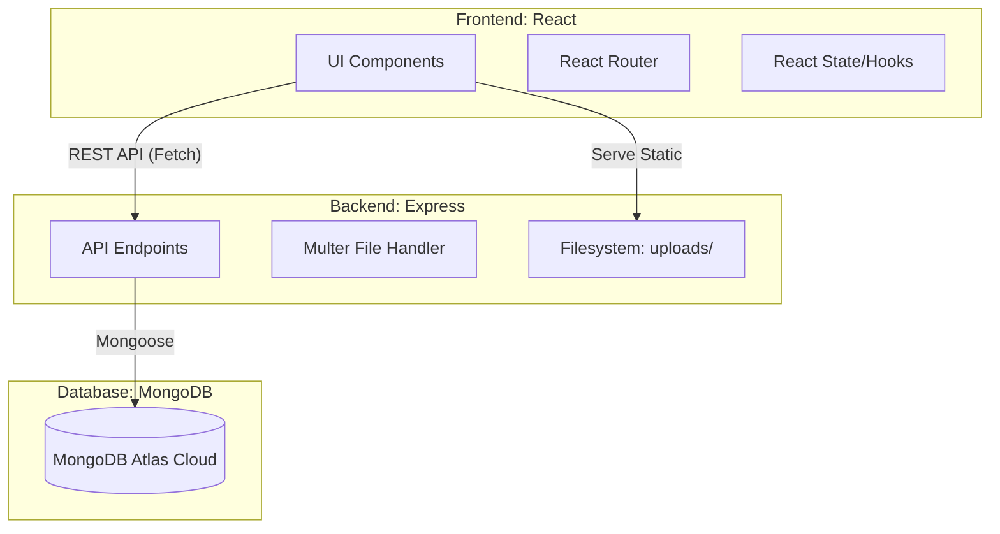

# LuminaBooks: Full-Stack Project Technical Report

This report summarizes the current state, architecture, and functional components of the **LuminaBooks** application as of today.

## 1. Project Status Summary
LuminaBooks has transitioned from a static frontend to a fully functional **MERN Stack** (MongoDB, Express, React, Node.js) application. It supports dynamic book management, local image uploads, and real-time database synchronization.

---

## 2. Frontend (React + Vite)
The frontend is built for performance and premium aesthetics.

### Key Features:
- **Dynamic Home Page**: Fetches and displays "Bestselling" books directly from the backend API.
- **Admin Dashboard**: A secure portal (hidden from public Navbar) for managing inventory.
- **Add Book System**: Includes a custom modal with form validation and a local file selector for cover images.
- **Delete System**: A custom confirmation modal that triggers a two-step cleanup (DB record + physical image file).
- **Responsive Design**: Premium UI with dark-mode accents and smooth Framer Motion animations.

---

## 3. Backend (Node.js + Express)
The backend acts as a robust RESTful API layer.

### Key Features:
- **REST API Routes**:
    - `GET /api/books`: Retrieves all books from MongoDB.
    - `POST /api/books`: Handles multipart/form-data (Multer) for adding books and images.
    - `DELETE /api/books/:id`: Safely removes a book and its physical image file from the server.
- **File Management**: Uses Multer to store uploaded images in the `/server/uploads` directory.
- **Security Middleware**: Includes a database connection health-check to prevent server crashes if the database is unreachable.

---

## 4. Connectivity & Data Flow
The Frontend and Backend are tightly integrated:
- **API Base URL**: `http://localhost:5000/api`
- **Data Exchange**: Standard JSON for metadata and `FormData` for image uploads.
- **Image Serving**: The Express server serves the `uploads/` folder as a static directory, allowing the frontend to display images via `http://localhost:5000/uploads/filename.jpg`.

---

## 5. Technical Architecture

---

## 6. Current Tech Stack
- **Database**: MongoDB Atlas (Primary) / Local MongoDB (Fallback).
- **Backend**: Node.js, Express.js, Mongoose, Multer.
- **Frontend**: React, Vite, Framer Motion, Lucide React, Vanilla CSS.
- **Environment**: Managed via `.env` files for security.

### Current Directory Structure:
- `/`: Frontend source.
- `/server/`: Backend source.
- `/server/uploads/`: Physical storage for book covers.

---
**Report Generated by Antigravity AI**
